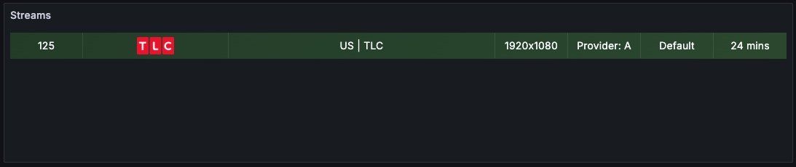
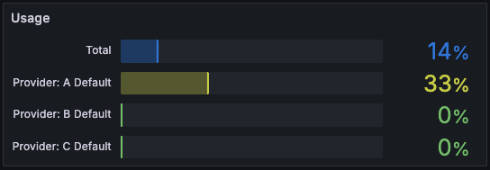
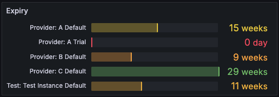
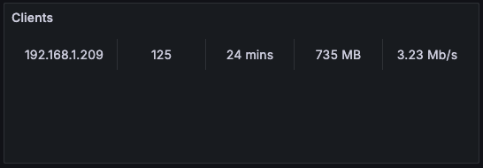
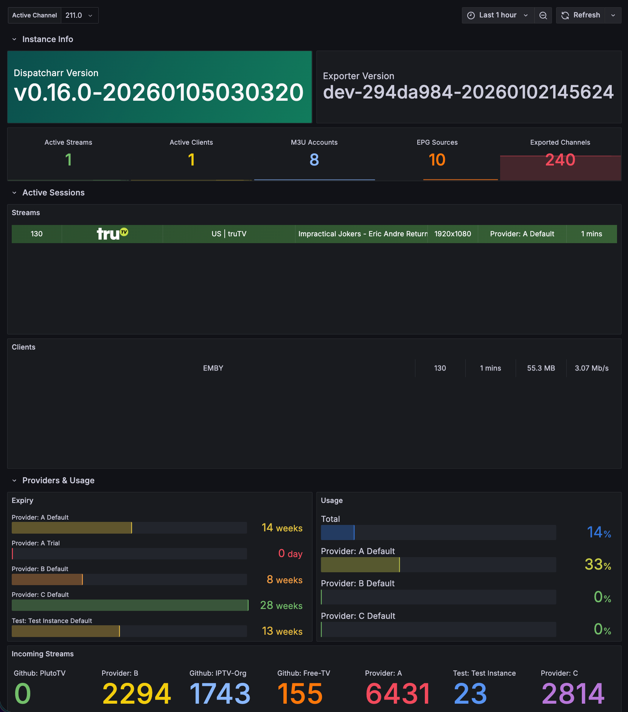

# Grafana Examples

Sample Grafana panels and dashboards for visualizing Dispatcharr metrics.

## Panels

Sample panel configurations are available in [`samples/panels/`](samples/panels/).

**Active Streams**

[View JSON](samples/panels/active-streams.json) - Active streams with metadata including channel info, bitrates, client counts, and uptime.

**Connection Usage**

[View JSON](samples/panels/connection-usage.json) - M3U profile connection usage against limits.

**Provider Expiry**

[View JSON](samples/panels/provider-expiry.json) - XC account expiration tracking.

**Active Clients**

[View JSON](samples/panels/active-clients.json) - Client connection statistics including transfer rates and data usage.

### Importing a Panel

1. In Grafana, create or edit a dashboard
2. Click **Add** > **Visualization**
3. Click the panel menu (three dots) > **Inspect** > **Panel JSON**
4. Paste the contents from one of the sample JSON files
5. Click **Apply**

## Dashboards

Pre-built dashboards are available in [`samples/dashboards/`](samples/dashboards/).

**Dispatcharr Overview**

[View JSON](samples/dashboards/Dispatcharr-1767806789544.json) - Complete monitoring dashboard with active streams, connection usage, provider expiry, and client statistics.

### Importing a Dashboard

1. In Grafana, go to **Dashboards** > **Import**
2. Click **Upload JSON file** and select the dashboard JSON
3. Select your Prometheus data source
4. Click **Import**
