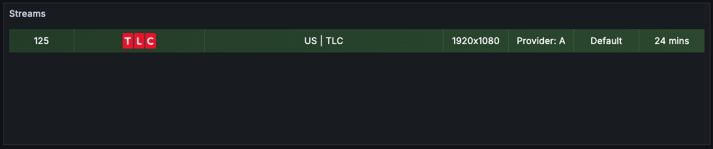
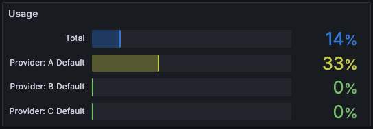
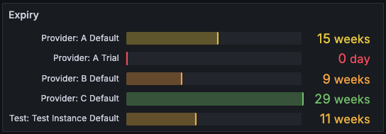
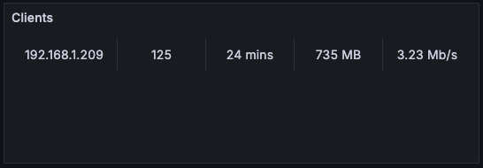

# Dispatcharr Prometheus Exporter Plugin

A Dispatcharr-compatible plugin that exposes metrics in Prometheus format for monitoring and alerting.

## Installation

### Download Latest Release

Download the latest version from the [GitHub Releases page](https://github.com/sethwv/dispatcharr-exporter/releases/latest).

Look for the asset named `dispatcharr-exporter-X.X.X.zip` and download it.

### Installing the Plugin

1. Download `dispatcharr-exporter-X.X.X.zip` from the [latest release](https://github.com/sethwv/dispatcharr-exporter/releases/latest)

2. In the Dispatcharr web UI, navigate to the **Plugins** page

3. Click the **"Import"** button and upload the downloaded zip file

4. Enable the plugin (you'll see a trust warning on first enable - this is normal)

5. Configure the plugin settings (see Configuration section below)

6. **⚠️ IMPORTANT: Restart Dispatcharr** after installing the plugin for it to fully initialize

### Alternative: Build from Source

1. Clone the repository and package the plugin:
   ```bash
   git clone https://github.com/sethwv/dispatcharr-exporter.git
   cd dispatcharr-exporter
   ./package.sh
   ```
   This creates `dispatcharr-exporter-dev-XXXXXXXX-XXXXXXXXXXXX.zip`

2. Import the zip file via the Plugins page in Dispatcharr UI

3. **⚠️ IMPORTANT: Restart Dispatcharr** after installation

### Updating the Plugin

> **Note:** The Dispatcharr plugin system is currently in early development. To update to a newer version:

1. In the Dispatcharr web UI, go to the **Plugins** page and disable/remove the plugin
2. Download the latest version from [releases](https://github.com/sethwv/dispatcharr-exporter/releases/latest)
3. Import the new version via the **"Import"** button
4. **⚠️ IMPORTANT: Restart Dispatcharr** for the update to take effect

### Uninstalling the Plugin

> **Note:** Due to the early state of the plugin system, you may need to manually remove files:

1. Stop Dispatcharr
2. Remove the plugin directory:
   ```bash
   rm -rf /path/to/dispatcharr/data/plugins/prometheus_exporter*
   ```
3. Start Dispatcharr
4. Go to the **Plugins** page and remove the plugin from the UI (if still listed)

## Recommended Environment Configuration

### Prevent Permission Issues (Recommended)

Add this environment variable to your Dispatcharr container to prevent root-owned Python bytecode cache files:

**In docker-compose.yml:**
```yaml
services:
  dispatcharr:
    environment:
      - PYTHONDONTWRITEBYTECODE=1
```

**Why this is recommended:**
- **Prevents update failures**: Dispatcharr runs some startup commands as root before switching to the non-root user, which can create root-owned `__pycache__` directories that prevent plugin updates
- **Cleaner filesystem**: No bytecode cache directories cluttering your plugin folders
- **Minimal impact**: Adds ~100-200ms to container startup time (one-time per restart)

**What it does:**
- Prevents Python from writing `.pyc` bytecode cache files to disk
- Python still compiles modules to bytecode in memory (no functionality changes)
- Once Dispatcharr is running, performance is identical

**What it doesn't affect:**
- ✅ All Python code runs normally
- ✅ All imports work the same
- ✅ In-memory caching still happens
- ✅ No features are disabled

**Without this variable:**
If you see errors like "Permission denied" when updating plugins, this is likely caused by root-owned `__pycache__` directories. You can clean them manually:
```bash
docker exec -u root <container-name> find /data/plugins -name __pycache__ -type d -exec rm -rf {} +
```

## Usage

### Starting the Metrics Server

**Option 1: Auto-start (Recommended for Production)**
1. Set "Auto-start Server" to `true` in plugin settings
2. Save settings
3. Restart Dispatcharr
4. Server will start automatically on first plugin initialization

**Option 2: Manual Start**
1. Configure the port and host in plugin settings
2. Click "Start Metrics Server" action
3. Server will start in background

### Accessing Metrics

Once the server is started, metrics are available at:
(You may need to map this port if running in docker)
```
http://your-dispatcharr-host:9192/metrics
http://your-dispatcharr-host:9192/health
```

## Features

This plugin exposes comprehensive Prometheus metrics for monitoring your Dispatcharr instance:

- **Core metrics** - Version and instance information
- **M3U account metrics** - Account status and connection tracking (enabled by default)
- **EPG source metrics** - EPG source status (optional)
- **Channel metrics** - Channel and group counts
- **Stream metrics** - Real-time stream statistics with optimized label structure
- **Client connection metrics** - Individual client tracking and transfer statistics (optional, privacy-focused)
- **VOD metrics** - Video on Demand session tracking (optional)

For a complete list of available metrics, query examples, and best practices, see **[METRICS.md](METRICS.md)**.

## Configuration

### Plugin Settings

- **Auto-start Server** (boolean, default: `false`): Automatically start metrics server when Dispatcharr starts
- **Suppress Access Logs** (boolean, default: `true`): Suppress HTTP access logs for /metrics requests
- **Disable Update Notifications** (boolean, default: `false`): Disable automatic update notifications (updates can still be checked manually via the 'Check for Updates' action)
- **Metrics Server Port** (number, default: `9192`): Port for the HTTP metrics server
- **Metrics Server Host** (string, default: `0.0.0.0`): Host address to bind
  - `0.0.0.0` - Listen on all network interfaces (accessible remotely)
  - `127.0.0.1` - Listen only on localhost (local access only)
- **Dispatcharr Base URL** (string, optional): URL for Dispatcharr API (e.g., http://localhost:5656 or https://dispatcharr.example.com). If set, logo URLs will be absolute instead of relative paths. Leave empty to use relative paths.

### Metric Visibility Controls

- **Include M3U Account Metrics** (boolean, default: `true`): Include M3U account and profile connection metrics
- **Include EPG Source Metrics** (boolean, default: `false`): Include EPG source status metrics
- **Include VOD Metrics** (boolean, default: `false`): Include VOD session and stream metrics
- **Include Client Connection Statistics** (boolean, default: `false`): Include individual client connection information
  - Warning: May expose sensitive information in metrics
- **Include Provider/Source Information** (boolean, default: `false`): Include server URLs & XC usernames in M3U account and EPG source metrics
  - Warning: Ensure this is DISABLED if sharing output in Discord for troubleshooting
- **Include Legacy Metric Formats** (boolean, default: `false`): Include backward-compatible metrics from v1.1.0 and earlier
  - Only enable if you have existing dashboards that need migration time
  - NOT recommended - use the new layered metrics instead for proper time series

### Plugin Actions

- **Start Metrics Server**: Starts the HTTP server on the configured port
- **Stop Metrics Server**: Stops the HTTP server
- **Restart Metrics Server**: Restarts the server (useful after changing settings)
- **Server Status**: Shows if the server is running and the endpoint URL
- **Check for Updates**: Check if a new version is available

## Grafana Usage Examples

For now, we only have a handful of example panels - eventually we'd like to include pre-built dashboards for importing.

### Example Panels
Sample Grafana panel configurations are available in the [`samples/panels/`](samples/panels/) directory to help you get started visualizing your Dispatcharr metrics.

**Active Streams**  
  
[View JSON](samples/panels/active-streams.json) - Monitor all active streams with detailed metadata including channel info, bitrates, client counts, and uptime.
- Query: Joins `dispatcharr_stream_uptime_seconds` with `dispatcharr_stream_metadata` to display enriched stream information

**Connection Usage**  
  
[View JSON](samples/panels/connection-usage.json) - Track M3U profile connection usage against limits to prevent overages.
- Query: Calculates `dispatcharr_profile_connection_usage` per profile and total usage across all profiles (excludes expired accounts)

**Provider Expiry**  
  
[View JSON](samples/panels/provider-expiry.json) - Monitor XC account expiration dates to avoid service interruptions.
- Query: Shows `dispatcharr_profile_days_to_expiry` for XC accounts with expiration dates set

**Active Clients**  
  
[View JSON](samples/panels/active-clients.json) - View detailed client connection statistics including transfer rates and data usage.
- Queries: Joins `dispatcharr_client_*` metrics with `dispatcharr_client_info` and `dispatcharr_stream_metadata` for enriched client details

### Using Panel JSON

1. In Grafana, create or edit a dashboard
2. Click **Add** → **Visualization** (select any data source/visualization type - it will be overwritten)
3. Click the panel menu (three dots) → **Inspect** → **Panel JSON**
4. Paste the contents from one of the sample JSON files
5. Click **Apply** to save the panel

These panels serve as starting points - customize them to match your specific monitoring needs!

## Grafana Usage Examples

For now, we only have a handful of example panels - eventually we'd like to include pre-built dashboards for importing.

### Example Panels
Sample Grafana panel configurations are available in the [`samples/panels/`](samples/panels/) directory to help you get started visualizing your Dispatcharr metrics.

**Active Streams**  
  
[View JSON](samples/panels/active-streams.json) - Monitor all active streams with detailed metadata including channel info, bitrates, client counts, and uptime.
- Query: Joins `dispatcharr_stream_uptime_seconds` with `dispatcharr_stream_metadata` to display enriched stream information

**Connection Usage**  
  
[View JSON](samples/panels/connection-usage.json) - Track M3U profile connection usage against limits to prevent overages.
- Query: Calculates `dispatcharr_profile_connection_usage` per profile and total usage across all profiles (excludes expired accounts)

**Provider Expiry**  
  
[View JSON](samples/panels/provider-expiry.json) - Monitor XC account expiration dates to avoid service interruptions.
- Query: Shows `dispatcharr_profile_days_to_expiry` for XC accounts with expiration dates set

**Active Clients**  
  
[View JSON](samples/panels/active-clients.json) - View detailed client connection statistics including transfer rates and data usage.
- Queries: Joins `dispatcharr_client_*` metrics with `dispatcharr_client_info` and `dispatcharr_stream_metadata` for enriched client details

### Using Panel JSON

1. In Grafana, create or edit a dashboard
2. Click **Add** → **Visualization** (select any data source/visualization type - it will be overwritten)
3. Click the panel menu (three dots) → **Inspect** → **Panel JSON**
4. Paste the contents from one of the sample JSON files
5. Click **Apply** to save the panel

These panels serve as starting points - customize them to match your specific monitoring needs!

## License

This plugin is provided as-is for use with Dispatcharr.